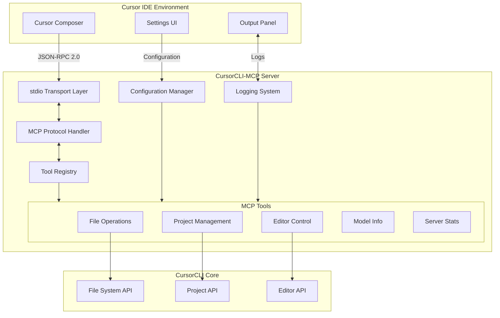
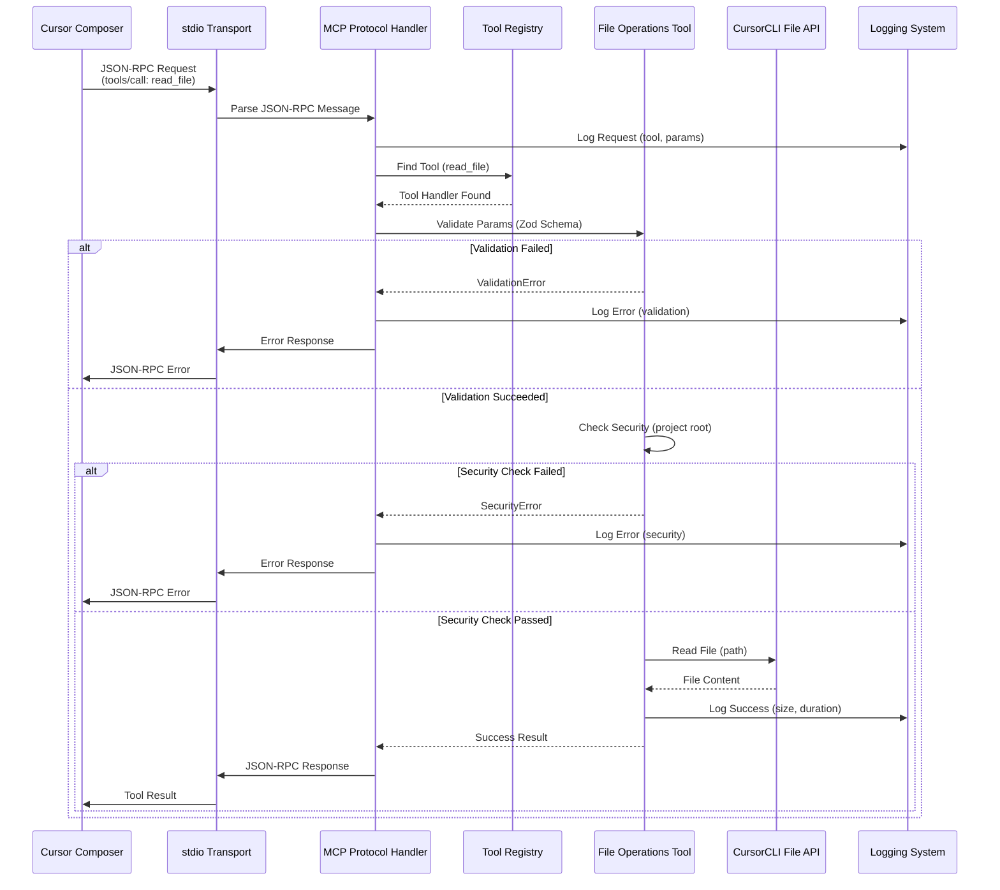
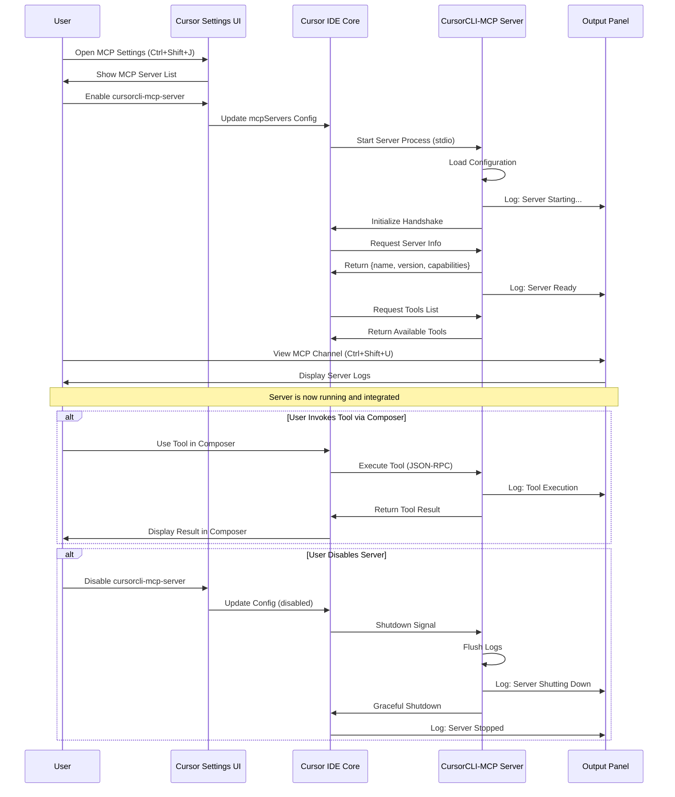

# Technical Design Document: CursorCLI-MCPServer

## Overview

CursorCLI-MCPServerは、既存のCursorCLI（Cursor IDE用CLIツール）をModel Context Protocol（MCP）サーバーとして機能拡張するシステムです。本システムにより、AIツールやCursor IDE自身が、CursorCLIの機能（ファイル操作、プロジェクト管理、エディタ制御など）を標準化されたMCPプロトコル経由で呼び出すことが可能になります。

MCPはJSON-RPC 2.0ベースのプロトコルであり、AIモデルとツール間の相互運用性を提供します。CursorCLIをMCPサーバー化することで、以下の価値を実現します：

- **相互運用性の向上**: 異なるAIツール間で統一されたインターフェースを提供し、開発効率を大幅に向上させます
- **拡張性の確保**: 新しいツールや機能を追加する際、MCPプロトコルに準拠するだけで既存のクライアントから利用可能になります
- **エコシステムの強化**: Cursor IDEエコシステム内での機能連携基盤を確立し、将来的なプラグイン開発を促進します

### Goals

- MCPプロトコル完全準拠のサーバー実装により、標準化されたAIツール連携を実現する
- CursorCLIの既存機能（ファイル操作、プロジェクト管理、エディタ制御）をMCPツールとして公開する
- Cursor IDE環境内でのシームレスな統合を提供し、Settings UIとOutput panelで完全な管理を可能にする
- セキュリティと安全性を最優先とし、プロジェクトルート外アクセスの制限と詳細なエラーハンドリングを実装する
- パフォーマンス要件（5秒以内のツール実行、5秒以内のサーバー起動）を満たす高速な実装を実現する

### Non-Goals

- Cursor IDE本体の機能拡張（本プロジェクトはCursorCLIのMCPサーバー化のみを対象とする）
- 既存CursorCLIコマンドラインインターフェースの変更（後方互換性を完全に維持）
- MCPプロトコル自体の拡張や独自プロトコルの追加（標準MCP仕様に厳格に準拠）
- ブラウザベースのWebインターフェース提供（Cursor IDE内統合に集中）
- リアルタイム協調編集機能（将来的な拡張として検討）
- 外部クラウドサービスへのデータ送信（すべての処理はローカルで完結）

## Architecture

### Feature Classification

本プロジェクトは**新規機能（New Feature）**に分類されます。既存のCursorCLIに対して、MCPサーバー機能という新しいアーキテクチャレイヤーを追加します。これは単純な機能追加ではなく、以下の特徴を持つ包括的なシステム拡張です：

- 新しい通信プロトコル（MCP over JSON-RPC 2.0）の実装
- 新しいアーキテクチャパターン（ツールベースアーキテクチャ）の導入
- Cursor IDE環境との深い統合（stdio transport、Settings UI、Output panel）
- 完全な型安全性とスキーマ検証機構の構築

### High-Level Architecture



### Architecture Integration

**既存パターンの保持**:
- CursorCLIの既存アーキテクチャは変更せず、新しいMCPレイヤーをアダプターパターンで統合します
- CursorCLIのFile System API、Project API、Editor APIへの既存インターフェースは完全に保持されます
- 既存のコマンドラインインターフェースは一切変更せず、後方互換性を100%維持します

**新規コンポーネントの合理性**:
- **MCP Protocol Handler**: JSON-RPC 2.0とMCP仕様準拠の通信を実現するために必須です
- **Tool Registry**: ツールの動的登録と検索を可能にし、拡張性を確保します
- **Configuration Manager**: Cursor IDE設定とサーバー設定を統合管理し、ユーザー体験を向上させます
- **Logging System**: Output panelとの統合による透明性の高いデバッグ環境を提供します

**技術スタック整合性**:
- TypeScript/Node.jsベースの実装により、Cursor IDE環境との親和性を最大化します
- `@modelcontextprotocol/sdk`公式SDKを活用し、標準準拠を保証します
- Zodスキーマバリデーションにより、型安全性とランタイム検証を両立します

**ステアリング原則の遵守**:
- モジュラー設計により、各コンポーネントが単一責任を持ちます
- インターフェース駆動開発により、テスト可能性と保守性を確保します
- セキュリティファーストアプローチにより、プロジェクトルート外アクセスを厳格に制限します

## Technology Stack and Design Decisions

### Runtime Environment
- **選択**: Node.js v18以上
- **根拠**: Cursor IDEがElectronベースでNode.js環境を提供するため、追加のランタイムインストールが不要です。また、TypeScriptの優れた型システムとエコシステムを活用できます
- **代替案**:
  - Python実装：プロトタイピングは容易だが、Cursor IDE統合時の追加依存関係が必要
  - Go実装：パフォーマンスは優れるが、Cursor環境との統合が複雑化
- **トレードオフ**: Node.jsはシングルスレッドのため、CPU集約的な処理には不向きですが、I/O中心のMCPサーバーでは問題になりません

### Language
- **選択**: TypeScript 5.x
- **根拠**:
  - 強力な型システムによりMCPプロトコルの型安全性を保証
  - Zodスキーマとの統合により、コンパイル時とランタイムの両方で型チェックを実現
  - Cursor IDE開発チームと同じ技術スタックで保守性を向上
- **代替案**:
  - JavaScript：型安全性の欠如により、MCPプロトコル実装でのバグリスクが増大
  - Rust：パフォーマンスは最高だが、開発速度とCursor統合の複雑さが問題
- **トレードオフ**: TypeScriptはコンパイルステップが必要ですが、ビルド時間は許容範囲内（数秒）です

### MCP Protocol Implementation
- **選択**: `@modelcontextprotocol/sdk` (公式SDK)
- **根拠**:
  - MCP仕様の完全準拠を保証
  - Anthropic公式サポートにより、プロトコル更新への迅速な対応が可能
  - TypeScript型定義により、開発時の生産性と安全性が向上
- **代替案**:
  - 独自実装：完全なコントロールを持つが、仕様追従のメンテナンスコストが膨大
  - 他のサードパーティライブラリ：公式SDKより機能が限定的で、長期サポートが不明確
- **トレードオフ**: 公式SDKへの依存により、SDK自体のバグの影響を受けますが、コミュニティサポートにより迅速に解決されます

### Schema Validation
- **選択**: Zod
- **根拠**:
  - TypeScript型定義から実行時バリデーションを自動生成
  - MCP SDK公式推奨のバリデーションライブラリ
  - 詳細なエラーメッセージによりデバッグ効率が向上
- **代替案**:
  - Joi：機能は豊富だが、TypeScript統合が弱い
  - Yup：React特化で、Node.jsサーバーサイドでは過剰
  - JSON Schema：標準だが、TypeScript型との同期が手動で煩雑
- **トレードオフ**: Zodはランタイムオーバーヘッドがありますが、ツール呼び出しの頻度とパフォーマンス要件（5秒以内）を考慮すると無視できます

### Communication Transport
- **選択**: stdio (標準入出力)
- **根拠**:
  - Cursor IDE推奨のトランスポート方式
  - プロセス間通信として最もシンプルで信頼性が高い
  - ネットワークポート不要でセキュリティリスクを最小化
- **代替案**:
  - HTTP/WebSocket：ネットワーク経由のアクセスが可能だが、Cursor IDE統合では不要で、セキュリティリスクが増大
  - Unix Domain Socket：Linux/macOSでは高速だが、Windows対応が複雑
- **トレードオフ**: stdioは大容量データ転送に不向きですが、MCPツールのレスポンスサイズ（10MB制限）内では問題ありません

### Logging
- **選択**: Winston
- **根拠**:
  - 成熟したNode.jsロギングライブラリで、豊富な機能セットを提供
  - 複数の出力先（コンソール、ファイル、Cursor Output panel）を統一的に管理
  - ログレベル、フォーマット、ローテーションなどの柔軟な設定が可能
- **代替案**:
  - Pino：パフォーマンスは最高だが、設定の複雑さが増す
  - Bunyan：JSON構造化ログに特化するが、人間可読性が低い
  - console.log：シンプルだが、ログレベル管理やファイル出力が不可能
- **トレードオフ**: Winstonは依存関係が増えますが、エンタープライズグレードのロギング機能により、運用時の問題解決効率が大幅に向上します

### Configuration Management
- **選択**: JSON設定ファイル + 環境変数
- **根拠**:
  - Cursor IDEの`mcpServers`設定と完全に互換
  - JSON形式により、Settings UIからの設定編集が容易
  - 環境変数によるシークレット管理で、認証情報の安全性を確保
- **代替案**:
  - YAML：可読性は高いが、Cursor IDEの標準設定形式と異なる
  - TOML：Rust由来で優れた設計だが、TypeScriptエコシステムでは普及していない
- **トレードオフ**: JSON形式はコメント不可ですが、設定項目の説明はドキュメントで補完します

### Key Design Decisions

#### Decision 1: MCPツールスキーマの型安全性確保

**Decision**: ZodスキーマとTypeScript型定義を単一ソースから生成する統合型システムを採用

**Context**: MCPツールは、パラメータスキーマとTypeScript型定義の両方が必要です。これらが不一致の場合、実行時エラーが発生し、デバッグが困難になります。特に、10個の要件領域で15以上のツールを定義するため、手動での同期は現実的ではありません。

**Alternatives**:
1. **手動での型とスキーマの二重定義**: TypeScript型とZodスキーマを別々に定義し、レビューで同期を確認
2. **TypeScriptからJSON Schemaを生成**: `typescript-json-schema`を使用してTypeScript型からJSON Schemaを生成
3. **ZodからTypeScriptを生成（選択）**: Zodスキーマを信頼の源とし、`z.infer`でTypeScript型を導出

**Selected Approach**: Zodスキーマを信頼の源（Single Source of Truth）とし、以下のパターンで実装します：

```typescript
import { z } from 'zod';

const ReadFileSchema = z.object({
  path: z.string().describe('読み取るファイルの相対パスまたは絶対パス'),
  encoding: z.enum(['utf-8', 'utf-16', 'binary']).default('utf-8').optional()
});

type ReadFileParams = z.infer<typeof ReadFileSchema>;

interface ReadFileResult {
  content: string;
  size: number;
  lastModified: string;
}
```

**Rationale**:
- Zodスキーマは実行時バリデーションとMCPツール定義の両方に使用されるため、信頼の源として最適です
- `z.infer`により、TypeScript型が自動的に導出され、同期の問題が完全に解消されます
- Zodの`describe()`メソッドにより、スキーマとドキュメントを一体化でき、保守性が向上します
- MCPクライアント（Cursor Composer）がツールパラメータのヒントを表示する際、`describe()`の内容が活用されます

**Trade-offs**:
- **利点**: 型とスキーマの完全な同期、実行時バリデーションの自動化、ドキュメント生成の簡略化
- **欠点**: Zodへの依存が強まり、将来的に別のバリデーションライブラリへの移行が困難
- **緩和策**: MCP SDKがZodを公式推奨しており、長期的なサポートが期待できるため、リスクは限定的です

#### Decision 2: Cursor IDE統合のためのstdioトランスポート実装

**Decision**: 双方向非同期通信を可能にするstdioベースのトランスポートレイヤーを実装

**Context**: Cursor IDEはMCPサーバーとstdio経由で通信します。JSON-RPC 2.0メッセージはstdinから受信し、stdoutに送信されます。しかし、Node.jsのstdioはデフォルトではラインバッファリングされ、大容量メッセージや並行リクエストの処理が困難です。

**Alternatives**:
1. **シンプルなラインベース処理**: `process.stdin.on('line')`でメッセージを1行ずつ処理
2. **チャンクベース処理**: `process.stdin.on('data')`でバッファリングしながら処理
3. **MCP SDK標準トランスポート（選択）**: `@modelcontextprotocol/sdk`の`StdioServerTransport`を使用

**Selected Approach**: MCP SDKが提供する`StdioServerTransport`クラスを使用し、以下の構成で実装します：

```typescript
import { Server } from '@modelcontextprotocol/sdk/server/index.js';
import { StdioServerTransport } from '@modelcontextprotocol/sdk/server/stdio.js';

const server = new Server({
  name: 'cursorcli-mcp-server',
  version: '1.0.0'
}, {
  capabilities: {
    tools: {},
    logging: {}
  }
});

const transport = new StdioServerTransport();
await server.connect(transport);
```

**Rationale**:
- MCP SDK標準実装により、プロトコル仕様の完全準拠が保証されます
- メッセージのフレーミング、バッファリング、エラーハンドリングが自動的に処理されます
- Cursor IDEとの互換性が公式に保証され、将来的なプロトコル更新にも自動対応します
- 複数のJSON-RPCメッセージが連続して送信される場合でも、正しくパースされます

**Trade-offs**:
- **利点**: プロトコル準拠の保証、Cursor IDE互換性の確実性、保守負担の軽減
- **欠点**: SDKの内部実装に依存し、細かいカスタマイズが困難
- **緩和策**: SDKのソースコードはオープンで、必要に応じてフォークやカスタマイズが可能です

#### Decision 3: ツール実行のタイムアウトと並行制御

**Decision**: Promise.raceベースのタイムアウト機構と、セマフォによる並行数制御を実装

**Context**: 要件では、ツール実行は5秒以内に完了する必要があり、同時に複数のリクエストを処理する能力が求められます。しかし、ファイル操作やエディタ制御は予期しない遅延が発生する可能性があり、適切なタイムアウトと並行制御が不可欠です。

**Alternatives**:
1. **AbortControllerベース**: Node.jsの`AbortController`を使用してキャンセル可能な操作を実装
2. **Promise.race + setTimeout（選択）**: タイムアウトPromiseと操作Promiseを競合させる
3. **Worker Threadsによる分離**: 各ツール実行を別スレッドで実行し、強制終了可能にする

**Selected Approach**: Promise.raceとセマフォパターンを組み合わせた実装：

```typescript
class ToolExecutor {
  private semaphore: Semaphore;
  private readonly TIMEOUT_MS = 5000;

  constructor(maxConcurrency: number = 10) {
    this.semaphore = new Semaphore(maxConcurrency);
  }

  async executeTool<T>(
    toolName: string,
    operation: () => Promise<T>
  ): Promise<T> {
    const release = await this.semaphore.acquire();

    try {
      const timeoutPromise = new Promise<never>((_, reject) =>
        setTimeout(() => reject(new TimeoutError(`Tool ${toolName} exceeded 5s timeout`)), this.TIMEOUT_MS)
      );

      return await Promise.race([operation(), timeoutPromise]);
    } finally {
      release();
    }
  }
}
```

**Rationale**:
- Promise.raceは追加のライブラリ不要で、Node.jsネイティブの機能として信頼性が高いです
- セマフォパターンにより、同時実行数を制限し、システムリソースの枯渇を防ぎます
- タイムアウト発生時でも、リクエストIDを正しく保持し、適切なエラーレスポンスを返却できます
- 設定可能な同時実行数により、環境に応じた調整が可能です

**Trade-offs**:
- **利点**: シンプルな実装、予測可能な動作、リソース保護
- **欠点**: タイムアウト後も実際の操作は継続する可能性があり、リソースリークのリスクがあります
- **緩和策**: 長時間実行される可能性がある操作（大容量ファイル読み込み）では、ストリーミングやチャンク処理を優先します

## System Flows

### Sequence Diagram: Tool Invocation Flow



### Process Flow: Configuration Loading and Validation

```mermaid
flowchart TD
    Start([Server Startup]) --> LoadConfig[Load Configuration File<br/>.cursorcli-mcp/config.json]
    LoadConfig --> ConfigExists{Config File<br/>Exists?}

    ConfigExists -->|No| GenerateDefault[Generate Default Config]
    ConfigExists -->|Yes| ParseConfig[Parse JSON Config]

    GenerateDefault --> WriteConfig[Write Default config.json]
    WriteConfig --> LoadEnvVars[Load Environment Variables]

    ParseConfig --> ValidateSchema{Valid JSON<br/>Schema?}
    ValidateSchema -->|No| LogError[Log Error: Invalid Config]
    ValidateSchema -->|Yes| MergeEnvVars[Merge Environment Variables]

    LogError --> UseDefault[Use Default Configuration]
    UseDefault --> LoadEnvVars

    MergeEnvVars --> LoadEnvVars
    LoadEnvVars --> ValidateSettings{Valid Settings<br/>(allowed tools, etc)?}

    ValidateSettings -->|No| LogWarning[Log Warning: Invalid Settings]
    ValidateSettings -->|Yes| ApplyConfig[Apply Configuration]

    LogWarning --> UseDefaults[Use Default for Invalid Settings]
    UseDefaults --> ApplyConfig

    ApplyConfig --> RegisterTools[Register Allowed Tools Only]
    RegisterTools --> SetupLogger[Setup Logger with Config]
    SetupLogger --> Ready([Server Ready])
```

### Event Flow: Cursor IDE Integration



## Requirements Traceability

| Requirement   | Summary                | Components                               | Interfaces                                                     | Flows                       |
| ------------- | ---------------------- | ---------------------------------------- | -------------------------------------------------------------- | --------------------------- |
| **1.1-1.5**   | MCPプロトコル準拠      | MCP Protocol Handler, Tool Registry      | `Server.initialize()`, `Server.listTools()`                    | Tool Invocation Flow        |
| **2.1-2.6**   | ファイル操作ツール     | File Operations Tool, Security Validator | `readFile()`, `writeFile()`, `listDirectory()`                 | Tool Invocation Flow        |
| **3.1-3.5**   | プロジェクト管理ツール | Project Management Tool                  | `getProjectInfo()`, `searchFiles()`, `getWorkspaceStructure()` | Tool Invocation Flow        |
| **4.1-4.6**   | エディタ制御ツール     | Editor Control Tool                      | `openFileInEditor()`, `insertText()`, `replaceText()`          | Tool Invocation Flow        |
| **5.1-5.6**   | エラーハンドリング     | Error Handler, Logger                    | `handleError()`, `logError()`                                  | All Flows                   |
| **6.1-6.6**   | 設定管理               | Configuration Manager                    | `loadConfig()`, `validateConfig()`, `watchConfig()`            | Configuration Loading Flow  |
| **7.1-7.6**   | ロギング               | Logging System, Output Panel Integration | `log()`, `logToOutputPanel()`                                  | All Flows                   |
| **8.1-8.6**   | パフォーマンス         | Tool Executor, Timeout Manager           | `executeWithTimeout()`, `limitConcurrency()`                   | Tool Invocation Flow        |
| **9.1-9.8**   | Cursor統合             | Settings UI Integration, stdio Transport | `StdioServerTransport`, Settings sync                          | Cursor IDE Integration Flow |
| **10.1-10.7** | モデル管理             | Model Info Tool, Context Manager         | `getCurrentModel()`, `trackTokenUsage()`                       | Tool Invocation Flow        |

## Components and Interfaces

### Protocol Layer

#### MCP Protocol Handler

**Responsibility & Boundaries**
- **Primary Responsibility**: JSON-RPC 2.0メッセージの解析、MCPプロトコルハンドシェイクの実行、ツール呼び出しのルーティング
- **Domain Boundary**: 通信プロトコルレイヤー（ビジネスロジックは含まない）
- **Data Ownership**: なし（ステートレスなメッセージハンドラー）
- **Transaction Boundary**: 各JSON-RPCリクエストが独立したトランザクション

**Dependencies**
- **Inbound**: stdio Transport Layer
- **Outbound**: Tool Registry, Configuration Manager, Logging System
- **External**: `@modelcontextprotocol/sdk` (MCP公式SDK)

**External Dependencies Investigation**:
- MCP SDK v1.0.0以上：公式Anthropicリポジトリから最新版を確認済み
- 主要APIサーフェス：`Server`クラス、`initialize()`、`listTools()`、`callTool()`メソッド
- 認証：MCPプロトコルはトランスポートレベルの認証をサポート（stdio使用時は不要）
- レート制限：プロトコルレベルではなし（アプリケーション側で実装）

**Service Interface**:
```typescript
interface MCPProtocolHandler {
  initialize(request: InitializeRequest): Promise<InitializeResult>;
  listTools(): Promise<ToolDefinition[]>;
  callTool(request: CallToolRequest): Promise<CallToolResult>;
  handleError(error: Error, requestId: string | number): ErrorResponse;
}

interface InitializeRequest {
  protocolVersion: string;
  capabilities: ClientCapabilities;
  clientInfo: { name: string; version: string };
}

interface InitializeResult {
  protocolVersion: string;
  capabilities: ServerCapabilities;
  serverInfo: { name: string; version: string };
}

interface CallToolRequest {
  name: string;
  arguments: Record<string, unknown>;
}

interface CallToolResult {
  content: ToolResponseContent[];
  isError?: boolean;
}

type ToolResponseContent = {
  type: 'text' | 'image' | 'resource';
  text?: string;
  data?: string;
  mimeType?: string;
};
```

**Preconditions**:
- サーバーがstdio transportで起動済み
- 設定ファイルが正常にロード済み

**Postconditions**:
- ツール実行結果またはエラーレスポンスが必ず返却される
- ログに実行トレースが記録される

**Invariants**:
- リクエストIDは常に保持され、レスポンスに含まれる
- MCPプロトコルバージョンはセッション中不変

#### stdio Transport Layer

**Responsibility & Boundaries**
- **Primary Responsibility**: 標準入出力経由のJSON-RPCメッセージ送受信、メッセージフレーミング
- **Domain Boundary**: 物理通信レイヤー
- **Data Ownership**: なし
- **Transaction Boundary**: 各メッセージが独立

**Dependencies**
- **Inbound**: Cursor IDE Core
- **Outbound**: MCP Protocol Handler
- **External**: Node.js `process.stdin/stdout`、`@modelcontextprotocol/sdk/server/stdio.js`

**API Contract**:
| Method  | Parameters              | Returns       | Errors          |
| ------- | ----------------------- | ------------- | --------------- |
| connect | server: Server          | Promise<void> | ConnectionError |
| send    | message: JSONRPCMessage | Promise<void> | WriteError      |
| close   | -                       | Promise<void> | -               |

**Event Contract**:
- **Published Events**: なし
- **Subscribed Events**:
  - `message`: JSON-RPCメッセージ受信時
  - `error`: トランスポートエラー発生時
  - `close`: 接続クローズ時

### Tool Layer

#### File Operations Tool

**Responsibility & Boundaries**
- **Primary Responsibility**: ファイルシステム操作（読み取り、書き込み、ディレクトリ一覧）のMCPツールとしての提供
- **Domain Boundary**: ファイルシステムドメイン（プロジェクトルート内限定）
- **Data Ownership**: なし（CursorCLI File APIに委譲）
- **Transaction Boundary**: 各ツール呼び出しが独立（トランザクションなし）

**Dependencies**
- **Inbound**: MCP Protocol Handler
- **Outbound**: CursorCLI File System API、Security Validator、Logging System
- **External**: Node.js `fs/promises`

**Service Interface**:
```typescript
interface FileOperationsTool {
  readFile(params: ReadFileParams): Promise<ReadFileResult>;
  writeFile(params: WriteFileParams): Promise<WriteFileResult>;
  listDirectory(params: ListDirectoryParams): Promise<ListDirectoryResult>;
}

const ReadFileSchema = z.object({
  path: z.string().describe('読み取るファイルの相対パスまたは絶対パス'),
  encoding: z.enum(['utf-8', 'utf-16le', 'binary']).default('utf-8').optional(),
  offset: z.number().min(0).optional().describe('読み取り開始位置（バイト）'),
  length: z.number().min(1).max(10_000_000).optional().describe('読み取りサイズ（バイト、最大10MB）')
});

type ReadFileParams = z.infer<typeof ReadFileSchema>;

interface ReadFileResult {
  content: string;
  size: number;
  encoding: string;
  truncated: boolean;
  lastModified: string;
}

const WriteFileSchema = z.object({
  path: z.string().describe('書き込み先ファイルの相対パスまたは絶対パス'),
  content: z.string().describe('書き込む内容'),
  encoding: z.enum(['utf-8', 'utf-16le']).default('utf-8').optional(),
  createDirectories: z.boolean().default(false).describe('親ディレクトリの自動作成'),
  overwrite: z.boolean().default(true).describe('既存ファイルの上書き許可')
});

type WriteFileParams = z.infer<typeof WriteFileSchema>;

interface WriteFileResult {
  success: boolean;
  path: string;
  size: number;
  created: boolean;
}

const ListDirectorySchema = z.object({
  path: z.string().describe('一覧を取得するディレクトリパス'),
  recursive: z.boolean().default(false).describe('サブディレクトリの再帰的取得'),
  includeHidden: z.boolean().default(false).describe('隠しファイルの含有'),
  pattern: z.string().optional().describe('ファイル名のglob パターン（例: *.ts）')
});

type ListDirectoryParams = z.infer<typeof ListDirectorySchema>;

interface ListDirectoryResult {
  entries: FileEntry[];
  totalCount: number;
  path: string;
}

interface FileEntry {
  name: string;
  path: string;
  type: 'file' | 'directory' | 'symlink';
  size: number;
  lastModified: string;
  permissions: string;
}
```

**Preconditions**:
- パスがプロジェクトルート内である（Security Validatorで検証）
- ファイルシステムへのアクセス権限がある

**Postconditions**:
- ファイル操作が成功した場合、結果オブジェクトが返却される
- 失敗した場合、詳細なエラー情報が例外としてスローされる
- 全ての操作がログに記録される

**Invariants**:
- プロジェクトルート外へのアクセスは常に拒否される
- レスポンスサイズは10MBを超えない（超過時は切り詰めとフラグ）

**Integration Strategy**:
- CursorCLI File APIを直接呼び出す（既存コードの変更なし）
- セキュリティレイヤーをラッパーとして追加

#### Project Management Tool

**Responsibility & Boundaries**
- **Primary Responsibility**: プロジェクト情報の取得、ファイル検索、ワークスペース構造の提供
- **Domain Boundary**: プロジェクトメタデータドメイン
- **Data Ownership**: なし（CursorCLI Project APIに委譲）
- **Transaction Boundary**: 各ツール呼び出しが独立

**Dependencies**
- **Inbound**: MCP Protocol Handler
- **Outbound**: CursorCLI Project API、Logging System
- **External**: なし

**Service Interface**:
```typescript
interface ProjectManagementTool {
  getProjectInfo(): Promise<ProjectInfo>;
  searchFiles(params: SearchFilesParams): Promise<SearchFilesResult>;
  getWorkspaceStructure(params: WorkspaceStructureParams): Promise<WorkspaceStructure>;
}

interface ProjectInfo {
  name: string;
  rootPath: string;
  settings: Record<string, unknown>;
  language: string;
  framework?: string;
}

const SearchFilesSchema = z.object({
  pattern: z.string().describe('検索パターン（glob形式）'),
  includeIgnored: z.boolean().default(false).describe('.gitignore対象の含有'),
  maxResults: z.number().min(1).max(1000).default(100).describe('最大結果数'),
  fileType: z.enum(['file', 'directory', 'all']).default('all')
});

type SearchFilesParams = z.infer<typeof SearchFilesSchema>;

interface SearchFilesResult {
  files: SearchResult[];
  totalCount: number;
  truncated: boolean;
}

interface SearchResult {
  path: string;
  type: 'file' | 'directory';
  size?: number;
  lastModified: string;
}

const WorkspaceStructureSchema = z.object({
  maxDepth: z.number().min(1).max(10).default(5).describe('ディレクトリツリーの最大深さ'),
  excludePatterns: z.array(z.string()).default([]).describe('除外パターン')
});

type WorkspaceStructureParams = z.infer<typeof WorkspaceStructureSchema>;

interface WorkspaceStructure {
  root: DirectoryNode;
  totalFiles: number;
  totalDirectories: number;
}

interface DirectoryNode {
  name: string;
  path: string;
  type: 'directory';
  children: (FileNode | DirectoryNode)[];
}

interface FileNode {
  name: string;
  path: string;
  type: 'file';
  size: number;
}
```

**Preconditions**:
- プロジェクトが開かれている（プロジェクトコンテキストが存在）
- CursorCLI Project APIが初期化済み

**Postconditions**:
- プロジェクト情報が取得できた場合、正確なデータが返却される
- プロジェクト未初期化時は`ProjectNotOpenError`がスローされる

**Invariants**:
- プロジェクトルートパスは常に絶対パス
- 検索結果は最大1000件に制限される

#### Editor Control Tool

**Responsibility & Boundaries**
- **Primary Responsibility**: Cursor IDEエディタの制御（ファイルオープン、テキスト編集、カーソル制御）
- **Domain Boundary**: エディタ制御ドメイン
- **Data Ownership**: なし（CursorCLI Editor APIに委譲）
- **Transaction Boundary**: 各操作が独立（エディタ状態は変更されるが、トランザクションではない）

**Dependencies**
- **Inbound**: MCP Protocol Handler
- **Outbound**: CursorCLI Editor API、Logging System
- **External**: Cursor IDE Extension API（間接的にCursorCLI経由）

**Service Interface**:
```typescript
interface EditorControlTool {
  openFileInEditor(params: OpenFileParams): Promise<OpenFileResult>;
  getActiveFile(): Promise<ActiveFileInfo>;
  insertText(params: InsertTextParams): Promise<EditResult>;
  replaceText(params: ReplaceTextParams): Promise<EditResult>;
}

const OpenFileSchema = z.object({
  path: z.string().describe('開くファイルのパス'),
  line: z.number().min(1).optional().describe('移動先の行番号'),
  column: z.number().min(1).optional().describe('移動先の列番号'),
  preview: z.boolean().default(false).describe('プレビューモードで開く')
});

type OpenFileParams = z.infer<typeof OpenFileSchema>;

interface OpenFileResult {
  success: boolean;
  path: string;
  isNewFile: boolean;
}

interface ActiveFileInfo {
  path: string | null;
  cursorPosition: { line: number; column: number } | null;
  selection: { start: Position; end: Position } | null;
  isDirty: boolean;
}

interface Position {
  line: number;
  column: number;
}

const InsertTextSchema = z.object({
  text: z.string().describe('挿入するテキスト'),
  position: z.object({
    line: z.number().min(1),
    column: z.number().min(1)
  }).optional().describe('挿入位置（省略時は現在のカーソル位置）')
});

type InsertTextParams = z.infer<typeof InsertTextSchema>;

const ReplaceTextSchema = z.object({
  text: z.string().describe('置換後のテキスト'),
  range: z.object({
    start: z.object({ line: z.number().min(1), column: z.number().min(1) }),
    end: z.object({ line: z.number().min(1), column: z.number().min(1) })
  }).describe('置換範囲')
});

type ReplaceTextParams = z.infer<typeof ReplaceTextSchema>;

interface EditResult {
  success: boolean;
  newCursorPosition: Position;
  linesAffected: number;
}
```

**Preconditions**:
- Cursor IDEが起動している
- エディタ操作対象のファイルが存在する（openFileInEditorを除く）

**Postconditions**:
- 操作が成功した場合、エディタ状態が変更される
- IDE未起動時は`IDENotRunningError`がスローされる
- 編集後のカーソル位置が返却される

**Invariants**:
- エディタ操作は同期的に完了する（Promise解決時点でエディタ状態が確定）
- 操作完了まで次のリクエストは待機する（シーケンシャル実行）

**Integration Strategy**:
- CursorCLI Editor APIを直接呼び出す
- エディタ状態の変更は既存APIに完全に委譲

#### Model Info Tool

**Responsibility & Boundaries**
- **Primary Responsibility**: Cursor Composerで選択されているAIモデル情報の取得、トークン消費統計の提供
- **Domain Boundary**: モデルコンテキストドメイン
- **Data Ownership**: モデル統計データ（トークン消費量、使用時間）
- **Transaction Boundary**: 統計データの更新は即座に反映される

**Dependencies**
- **Inbound**: MCP Protocol Handler
- **Outbound**: Cursor IDE Context API、Logging System
- **External**: Cursor IDE Composer API（間接的）

**Service Interface**:
```typescript
interface ModelInfoTool {
  getCurrentModel(): Promise<ModelInfo>;
  trackTokenUsage(params: TrackTokenUsageParams): Promise<void>;
  getModelStatistics(): Promise<ModelStatistics>;
}

interface ModelInfo {
  name: string;
  provider: string;
  version?: string;
  contextWindow: number;
  costPer1kTokens?: { input: number; output: number };
}

const TrackTokenUsageSchema = z.object({
  modelName: z.string(),
  inputTokens: z.number().min(0),
  outputTokens: z.number().min(0),
  duration: z.number().min(0).describe('実行時間（ミリ秒）')
});

type TrackTokenUsageParams = z.infer<typeof TrackTokenUsageSchema>;

interface ModelStatistics {
  totalSessions: number;
  totalTokensUsed: { input: number; output: number };
  estimatedCost: number;
  averageDuration: number;
  modelBreakdown: Record<string, ModelUsage>;
}

interface ModelUsage {
  count: number;
  tokens: { input: number; output: number };
  averageDuration: number;
}
```

**Preconditions**:
- Cursor Composerが起動している
- モデル情報が取得可能な状態

**Postconditions**:
- 現在のモデル情報が返却される
- トークン統計が正確に記録される

**Invariants**:
- トークン統計は累積され、リセットされない（サーバー再起動まで）
- モデル情報取得失敗時はデフォルトモデル情報を返却

**State Management**:
- **State Model**: トークン統計データをメモリ内に保持（永続化は将来対応）
- **Persistence**: なし（現バージョンではメモリのみ）
- **Concurrency**: トークン統計更新時は排他制御（Mutexパターン）

### Supporting Layer

#### Configuration Manager

**Responsibility & Boundaries**
- **Primary Responsibility**: 設定ファイルの読み込み、環境変数の統合、設定の検証とデフォルト値提供
- **Domain Boundary**: 設定管理ドメイン
- **Data Ownership**: サーバー設定データ
- **Transaction Boundary**: 設定読み込みと適用が1トランザクション

**Dependencies**
- **Inbound**: MCP Protocol Handler、全てのToolコンポーネント
- **Outbound**: File System、Logging System
- **External**: Node.js `fs/promises`、`chokidar`（ファイル監視）

**Service Interface**:
```typescript
interface ConfigurationManager {
  loadConfig(): Promise<ServerConfig>;
  validateConfig(config: unknown): Result<ServerConfig, ValidationError>;
  watchConfig(callback: (newConfig: ServerConfig) => void): void;
  getConfig(): ServerConfig;
}

interface ServerConfig {
  server: {
    name: string;
    version: string;
    maxConcurrentRequests: number;
    requestTimeoutMs: number;
  };
  tools: {
    allowedTools: string[];
    fileOperations: {
      maxFileSize: number;
      allowedDirectories: string[];
      blockedPatterns: string[];
    };
  };
  logging: {
    level: 'debug' | 'info' | 'warn' | 'error';
    outputs: ('console' | 'file' | 'cursor-output-panel')[];
    logFile?: string;
    maxLogSize: number;
    rotationCount: number;
  };
  security: {
    enforceProjectRoot: boolean;
    allowDestructiveOperations: boolean;
  };
}

type Result<T, E> = { ok: true; value: T } | { ok: false; error: E };

interface ValidationError {
  field: string;
  message: string;
  received: unknown;
}
```

**Preconditions**:
- 設定ファイルディレクトリ（`.cursorcli-mcp/`）が存在または作成可能
- 環境変数が有効な形式

**Postconditions**:
- 有効な設定オブジェクトが返却される
- 設定ファイル不在時はデフォルト設定が生成される
- 不正な設定値はデフォルトに置換される

**Invariants**:
- 設定は常に有効な状態（バリデーション済み）
- 設定変更時は即座に全コンポーネントに通知される

#### Security Validator

**Responsibility & Boundaries**
- **Primary Responsibility**: ファイルパスのセキュリティ検証、プロジェクトルート外アクセスの防止
- **Domain Boundary**: セキュリティドメイン
- **Data Ownership**: なし（ステートレスバリデーター）
- **Transaction Boundary**: 各検証が独立

**Dependencies**
- **Inbound**: File Operations Tool、Project Management Tool
- **Outbound**: Configuration Manager、Logging System
- **External**: Node.js `path`

**Service Interface**:
```typescript
interface SecurityValidator {
  validatePath(path: string): Result<string, SecurityError>;
  isWithinProjectRoot(path: string): boolean;
  sanitizePath(path: string): string;
}

interface SecurityError {
  code: 'PATH_TRAVERSAL' | 'OUTSIDE_PROJECT_ROOT' | 'BLOCKED_PATTERN';
  message: string;
  attemptedPath: string;
}
```

**Preconditions**:
- プロジェクトルートパスが設定済み
- パスが文字列として提供される

**Postconditions**:
- 安全なパスが返却される、または例外がスローされる
- 全ての検証結果がログに記録される

**Invariants**:
- プロジェクトルート外のパスは常に拒否される
- パストラバーサル（`../`など）は常に検出される

#### Logging System

**Responsibility & Boundaries**
- **Primary Responsibility**: 統一されたログ記録、Cursor Output panelへのログ出力、ログローテーション
- **Domain Boundary**: 横断的関心事（クロスカッティング）
- **Data Ownership**: ログデータ
- **Transaction Boundary**: 各ログエントリが独立

**Dependencies**
- **Inbound**: 全てのコンポーネント
- **Outbound**: File System、Cursor Output Panel（stdio経由）
- **External**: `winston`、`winston-daily-rotate-file`

**Service Interface**:
```typescript
interface LoggingSystem {
  debug(message: string, context?: LogContext): void;
  info(message: string, context?: LogContext): void;
  warn(message: string, context?: LogContext): void;
  error(message: string, error?: Error, context?: LogContext): void;
  logToolExecution(toolName: string, params: unknown, result: unknown, duration: number): void;
}

interface LogContext {
  requestId?: string | number;
  toolName?: string;
  userId?: string;
  [key: string]: unknown;
}
```

**Preconditions**:
- ログ出力先（ファイル、コンソール）が設定済み
- Cursor Output panelが利用可能（オプショナル）

**Postconditions**:
- ログが設定された全出力先に記録される
- ログファイルがサイズ制限を超えた場合、ローテーションされる

**Invariants**:
- ログレベルは設定に従い、低レベルのログは出力されない
- ログエントリは常にタイムスタンプを含む
